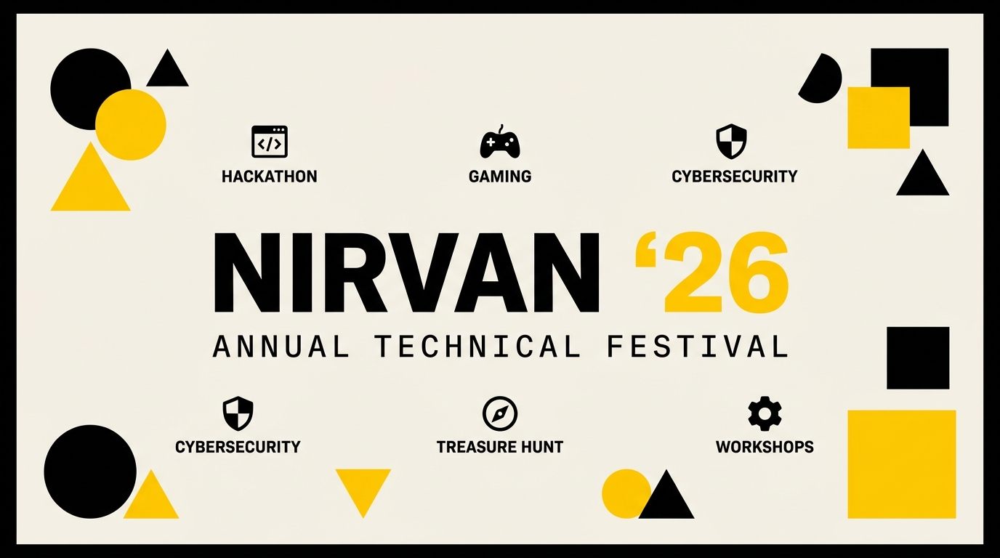

<div align="center">



<br />
<br />

# ⚡ NIRVAN '26 — Annual Technical Festival

### *Where Innovation Meets Competition*

[](https://react.dev)
[](https://vitejs.dev)
[](https://tailwindcss.com)
[](https://firebase.google.com)
[](LICENSE)
[](https://webathon-nirvan.vercel.app)

<br />

**The official website for NIRVAN '26 — the flagship annual technical festival of [Graphic Era Hill University](https://www.gehu.ac.in/), Bhimtal.**
Built with a bold **Brutalist / Bauhaus design language** that stands out from every other college fest website.

<br />

[🌐 **Live Demo**](https://webathon-nirvan.vercel.app) · [📋 **Report Bug**](https://github.com/sanidhyanegi07/webathon/issues) · [✨ **Request Feature**](https://github.com/sanidhyanegi07/webathon/issues) · [🤝 **Sponsor Us**](#-sponsorship--partnership)

---

</div>

<br />

## 📸 Preview

<div align="center">

| Hero Section | Events Grid | Sponsor Tiers |
|:---:|:---:|:---:|
| Brutalist countdown timer with animated ticker strip & Bauhaus geometric elements | Filterable event cards with category tags & full-text search | 4-tier pricing grid with interactive hover transforms |

| Schedule View | Speaker Directory | Registration Modal |
|:---:|:---:|:---:|
| Multi-day, track-filtered timeline with venue info | Expandable speaker profile cards with bios | Firebase-powered multi-step registration with confetti 🎉 |

> **👆 See it live →** [webathon-nirvan.vercel.app](https://webathon-nirvan.vercel.app)

</div>

<br />

---

## 🎯 About the Project

**NIRVAN '26** is a 4-day, campus-wide technical festival at Graphic Era Hill University (GEHU), Bhimtal — bringing together **500+ participants**, **₹1.75 Lakh+ in prizes**, and **5 flagship events** under one roof.

This repository houses the **official event website** — designed to serve as the single source of truth for event information, schedules, speaker profiles, sponsorship tiers, and live registrations. Every pixel is crafted with intention using a custom **brutalist design system** that commands attention.

### 🏆 Why This Project Stands Out

| Feature | Description |
|:---|:---|
| 🎨 **Custom Brutalist Design System** | Hand-built component library (`brutal-btn`, `card-brutal`, `section-label`) — zero generic templates used |
| ⚡ **Real-Time Countdown** | Live countdown timer with animated hover states, tabular number formatting, and shadow transforms |
| 🎫 **Firebase Registration** | Full Google Auth + multi-step event registration with Firestore backend & localStorage fallback |
| 🔎 **Smart Event Discovery** | Category filters + full-text search across 5 flagship events with detailed modals |
| 📱 **Fully Responsive** | Optimized for all devices — mobile-first layout with progressive enhancement |
| 🎭 **Micro-Animations** | Hover transforms, shimmer effects, scroll-triggered reveals, animated ticker strip, confetti on registration |
| 🏢 **4-Tier Sponsorship Portal** | Interactive pricing cards with hover lifts, scaling effects, and clear CTA hierarchy |
| 🖼️ **Photo Gallery** | Category-filterable gallery with lightbox modal and smooth transitions |
| 🗓️ **Multi-Day Schedule** | Day-by-day, track-filtered schedule viewer with venue information |
| 🎙️ **Speaker Profiles** | Expandable speaker cards with bios, org affiliations, and color-coded avatars |
| 📬 **Contact & Newsletter** | Brutalist-styled contact section with newsletter signup |
| 🎟️ **Ticket Generation** | Auto-generated unique ticket IDs (e.g., `N26-X7K2P9`) on successful registration |

<br />

---

## 🛠️ Tech Stack & Architecture

<div align="center">

```
┌─────────────────────────────────────────────────────────────┐
│                     NIRVAN '26 STACK                        │
├─────────────────────────────────────────────────────────────┤
│                                                             │
│  ┌──────────────┐  ┌──────────┐  ┌────────────────────┐    │
│  │  React 18    │  │  Vite 5  │  │  Tailwind CSS 3.4  │    │
│  │  Frontend    │  │  Bundler  │  │     Styling        │    │
│  └──────────────┘  └──────────┘  └────────────────────┘    │
│                                                             │
│  ┌──────────────┐  ┌────────────┐  ┌───────────────────┐   │
│  │ Firebase 10  │  │   Lucide   │  │  Canvas Confetti  │   │
│  │ Auth + Store │  │   Icons    │  │   Celebrations    │   │
│  └──────────────┘  └────────────┘  └───────────────────┘   │
│                                                             │
│  ┌──────────────┐  ┌────────────┐  ┌───────────────────┐   │
│  │   PostCSS    │  │ Autoprefxr │  │  GitHub Actions   │   │
│  │  Processing  │  │  Compat    │  │     CI/CD         │   │
│  └──────────────┘  └────────────┘  └───────────────────┘   │
│                                                             │
└─────────────────────────────────────────────────────────────┘
```

</div>

| Layer | Technology | Purpose |
|:---|:---|:---|
| **Frontend Framework** | React 18 | Component-based UI with hooks & context API |
| **Build Tool** | Vite 5 | Lightning-fast HMR, optimized production builds |
| **Styling** | Tailwind CSS 3.4 | Utility-first CSS with custom brutalist theme extensions |
| **Typography** | Space Grotesk + Inter + Bebas Neue | Headlines, body text, and decorative display via Google Fonts |
| **Icons** | Lucide React | Consistent, tree-shakeable icon set (40+ icons used) |
| **Backend** | Firebase (Auth + Firestore) | Google authentication & event registrations with real-time sync |
| **Animations** | Canvas Confetti | Celebratory particle effects on successful registration |
| **Utilities** | clsx + tailwind-merge | Conditional class composition without style conflicts |
| **Deployment** | GitHub Pages | Automated CI/CD via GitHub Actions with SPA routing support |

<br />

---

## 🎨 Design System

NIRVAN '26 follows a strict **Brutalist / Bauhaus** design philosophy — bold, geometric, unapologetic. No rounded corners. No soft shadows. Pure intention.

### Color Palette

| Swatch | Name | Hex | Usage |
|:---:|:---|:---|:---|
| 🟡 | **Accent Yellow** | `#FFCC00` | Primary accent, CTAs, highlights, selection |
| ⬛ | **Border Black** | `#1A1A1A` | Borders, text, shadows, scrollbar thumb |
| 🟤 | **Cream** | `#F5F0E8` | Background, negative space, scrollbar track |
| ⬜ | **Surface White** | `#FFFFFF` | Cards, modals, input fields |
| 🔴 | **Alert Red** | `#E63B2E` | Warnings, emphasis, speaker accents |
| 🔵 | **Link Blue** | `#0055FF` | Interactive elements, CTF category |
| ⚫ | **Muted** | `#6B6B6B` | Secondary text, timestamps |

### Typography

| Font | Weight | Usage |
|:---|:---|:---|
| **Space Grotesk** | 400–900 | Headlines, navigation, labels, countdown |
| **Inter** | 400–700 | Body text, descriptions, bios |
| **Bebas Neue** | 400 | Decorative / large display text |

### Component Library

```css
.brutal-btn          /* Primary CTA — solid black bg, yellow on hover, shadow lift + offset */
.brutal-btn-outline  /* Secondary CTA — outlined with fill-on-hover transition */
.card-brutal         /* Content cards with 8px shadow offset on hover + translate */
.section-label       /* Uppercase pill labels with shimmer gradient animation */
.skeleton            /* Loading placeholder with shimmer animation */
.ticker-wrap         /* Infinite horizontal scroll ticker (pauses on hover) */
```

**Signature Shadow Pattern:**
```
Normal:  4px 4px 0px 0px #1A1A1A
Hover:   8px 8px 0px 0px #1A1A1A  (with -4px translate)
Active:  0px 0px 0px 0px           (with +2px translate — "press" effect)
```

<br />

---

## 🏗️ Project Structure

```
Web-a-thon/
├── 📄 index.html                 # Entry point with SEO meta tags & error boundary
├── 📦 package.json               # Dependencies & scripts
├── 🎨 tailwind.config.js         # Custom theme (colors, fonts, animations, shadows)
├── 🔧 vite.config.js             # Vite dev server on port 3000
├── 🔧 postcss.config.js          # PostCSS + Autoprefixer pipeline
├── 🔥 firebase.json              # Firebase hosting rules
├── 🛡️ firestore.rules            # Firestore security rules
│
├── 📁 .github/
│   └── workflows/
│       └── deploy.yml            # GitHub Pages CI/CD pipeline (auto-build + deploy)
│
├── 📁 public/
│   └── assets/
│       ├── nirvan-banner.jpg     # Hero banner image
│       ├── gehu-logo.jpg         # Graphic Era Hill University logo
│       ├── tech-geeks-logo.jpg   # Tech Geeks club logo
│       └── gallery/              # Event photo gallery images
│           ├── photo1.jpg – photo5.jpg
│
└── 📁 src/
    ├── 🏠 App.jsx                # Root layout — assembles all 9 sections + modal
    ├── 🎨 index.css              # Global styles & Tailwind @layer overrides
    ├── 🚀 main.jsx               # React DOM entry point
    │
    ├── 📁 components/            # UI Sections (11 components)
    │   ├── Navbar.jsx            # Sticky navigation with mobile hamburger menu
    │   ├── HeroSection.jsx       # Animated hero — countdown + ticker + Bauhaus shapes
    │   ├── AboutSection.jsx      # Stats grid + festival description
    │   ├── EventsSection.jsx     # Filterable event cards + detail modal
    │   ├── ScheduleSection.jsx   # Multi-day schedule with track filters
    │   ├── SpeakersSection.jsx   # Expandable speaker profile cards
    │   ├── SponsorsSection.jsx   # 4-tier sponsorship pricing grid
    │   ├── GallerySection.jsx    # Photo gallery with category tabs + lightbox
    │   ├── ContactSection.jsx    # Contact form + social links + newsletter
    │   ├── Footer.jsx            # Footer with quick links + newsletter
    │   └── RegistrationModal.jsx # Multi-step registration form + ticket generation
    │
    ├── 📁 context/
    │   └── AuthContext.jsx       # Firebase Auth provider (React Context API)
    │
    ├── 📁 data/
    │   └── index.js              # All event, schedule, speaker & gallery data
    │
    ├── 📁 hooks/
    │   └── useRegistration.js    # Custom hook — Firestore writes + localStorage fallback
    │
    └── 📁 lib/
        ├── firebase.js           # Firebase app initialization
        └── utils.js              # Utility functions (cn, formatCountdown)
```

<br />

---

## 🎪 Flagship Events

<div align="center">

| Event | Category | Prize Pool | Team Size | Duration |
|:---|:---:|:---:|:---:|:---:|
| ⚡ **Hackathon** | Coding | ₹50,000 | 2–4 | 24 Hours |
| 🗺️ **Treasure Hunt** | Adventure | ₹20,000 | 3–5 | 5 Hours |
| 🎮 **E-Sports Arena** | Gaming | ₹40,000 | 1–5 | Full Day |
| 🚩 **Capture The Flag** | Security | ₹25,000 | 1–3 | 6 Hours |
| 🛠️ **Workshop Series** | Learning | Certificate | Individual | 2 Days |

### 💰 Total Prize Pool: ₹1,75,000+

</div>

<br />

---

## 🚀 Getting Started

### Prerequisites

| Tool | Version | Download |
|:---|:---|:---|
| **Node.js** | ≥ 18.x | [nodejs.org](https://nodejs.org) |
| **npm** | ≥ 9.x | Comes with Node.js |
| **Git** | Latest | [git-scm.com](https://git-scm.com) |

### Installation

```bash
# 1. Clone the repository
git clone https://github.com/sanidhyanegi07/webathon.git

# 2. Navigate to the project
cd webathon

# 3. Install dependencies
npm install

# 4. Start the development server
npm run dev
```

The app will be live at **`http://localhost:3000`** ⚡

### Build for Production

```bash
# Create optimized production build
npm run build

# Preview the production build locally
npm run preview
```

<br />

---

## 🔥 Firebase Setup (Optional)

To enable user authentication and event registrations, create a `.env.local` file in the root directory:

```env
VITE_FIREBASE_API_KEY=your_api_key
VITE_FIREBASE_AUTH_DOMAIN=your_auth_domain
VITE_FIREBASE_PROJECT_ID=your_project_id
VITE_FIREBASE_STORAGE_BUCKET=your_storage_bucket
VITE_FIREBASE_MESSAGING_SENDER_ID=your_sender_id
VITE_FIREBASE_APP_ID=your_app_id
```

> **💡 Note:** The website works perfectly without Firebase — registration features gracefully fall back to `localStorage`, so you can explore the full UI without any backend setup.

<br />

---

## 🚢 Deployment

### GitHub Pages (Automated — Recommended)

This repo includes a pre-configured GitHub Actions workflow:

| File | Trigger | What It Does |
|:---|:---|:---|
| [`.github/workflows/deploy.yml`](.github/workflows/deploy.yml) | Push to `main` / `master` | Installs deps → Builds → Copies `404.html` for SPA routing → Deploys to GitHub Pages |

**Steps:**
1. Enable GitHub Pages in your repo settings (source: GitHub Actions)
2. Push to `main` or `master` branch
3. GitHub Actions automatically builds and deploys ✅

### Manual Deployment (Any Static Host)

```bash
npm run build
# Upload the `dist/` folder to Netlify, Vercel, Cloudflare Pages, or any static host
```

<br />

---

## 🤝 Sponsorship & Partnership

NIRVAN '26 offers structured sponsorship tiers designed for maximum brand visibility:

| Tier | Investment | Key Benefits |
|:---|:---:|:---|
| 🟢 **Startup** | ₹20,000 | Logo placement, 2 passes, resume access, virtual swag bag insert |
| 🔵 **Growth** | ₹50,000 | Prominent logo, dedicated booth, 4 passes, social media features |
| 🟣 **Enterprise** | ₹1,00,000 | Merchandise branding, speaking slot, premium booth, custom challenge creation |
| 🟡 **Presenting Partner** | ₹2,50,000+ | **"Presented by"** title branding, keynote stage time (20 min), judge panel, VIP access, exclusive branding rights |

> **Interested in partnering?** Reach out via the [Contact section](https://webathon-nirvan.vercel.app#contact) on the website or email the organizing team directly.

<br />

---

## 🎙️ Featured Speakers

| Speaker | Role | Organization |
|:---|:---|:---|
| **Prof. Rajiv Sharma** | Dean of Engineering | Graphic Era Hill University |
| **Ananya Mehta** | Senior Software Engineer | Google India |
| **Karan Vohra** | Cybersecurity Researcher | DRDO / IIT Delhi (Alum) |
| **Priya Nair** | Product Designer | Figma (Bangalore) |

<br />

---

## 📅 Event Schedule

| Day | Date | Highlights |
|:---|:---|:---|
| **Day 1** | Oct 24, 2026 | Opening Ceremony, Hackathon Kick-off, Treasure Hunt, AI/ML Workshop |
| **Day 2** | Oct 25, 2026 | CTF Competition, Full-Stack Workshop, Hackathon Presentations |
| **Day 3** | Oct 26, 2026 | E-Sports Tournament (Valorant, BGMI, FIFA), Grand Finals |
| **Day 4** | Oct 27, 2026 | Speaker Sessions, Closing Ceremony & Prize Distribution |

<br />

---

## 🧑‍💻 Contributing

We welcome contributions! Here's how you can help:

```bash
# 1. Fork the repository
# 2. Create a feature branch
git checkout -b feature/amazing-feature

# 3. Commit your changes (use conventional commits)
git commit -m "feat: add amazing feature"

# 4. Push to the branch
git push origin feature/amazing-feature

# 5. Open a Pull Request
```

### Contribution Guidelines

| Rule | Details |
|:---|:---|
| 🎨 **Design System** | Follow the existing brutalist design — no rounded corners, no soft shadows |
| 🔤 **Typography** | Use **Space Grotesk** for headlines, **Inter** for body text |
| 🧩 **Components** | New components should use `@layer components` in `index.css` |
| 🎨 **Colors** | Stick to the palette defined in `tailwind.config.js` |
| 📝 **Commits** | Use [Conventional Commits](https://www.conventionalcommits.org/) (`feat:`, `fix:`, `docs:`) |

<br />

---

## 👥 Built With ❤️ By

<div align="center">

| Contributor | Role |
|:---:|:---:|
| **[Sanidhya](https://github.com/sanidhyanegi07)** | 🚀 Lead Developer |
| **Karan** | 💻 Developer |
| **Rudraksh** | 💻 Developer |
| **Shobhit** | 💻 Developer |

*Students of Graphic Era Hill University, Bhimtal*

</div>

<br />

---

## 📄 License

This project is licensed under the **MIT License** — see the [LICENSE](LICENSE) file for details.

<br />

---

<div align="center">

### ⭐ If you found this useful, give it a star!

**Built for the Web-a-thon hackathon** 🏆

*Crafted with React, Vite, Tailwind CSS, Firebase, and a lot of ☕*

<br />

[](https://github.com/sanidhyanegi07/webathon/stargazers)
[](https://github.com/sanidhyanegi07/webathon/network/members)
[](https://github.com/sanidhyanegi07/webathon/issues)

</div>

