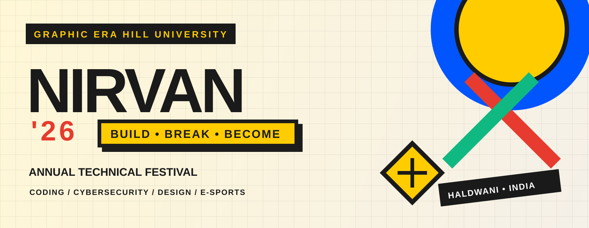

<div align="center">

# ⚡ NIRVAN '26

### **Build. Break. Become.**

<a href="https://webathon-nirvan.vercel.app/"></a>

### Uttarakhand's premier engineering, cybersecurity & e-sports showdown

[](https://webathon-nirvan.vercel.app/)
[](https://react.dev/)
[](https://vitejs.dev/)
[](https://tailwindcss.com/)
[](https://firebase.google.com/)
[](LICENSE)

[🌐 **Explore Live Demo**](https://webathon-nirvan.vercel.app) · [📋 **Report Issue**](https://github.com/Sanidhyanegi07/webathon/issues) · [✨ **Request Feature**](https://github.com/Sanidhyanegi07/webathon/issues) · [🤝 **Sponsorship**](mailto:sanidhyanegi050107@://gmail.com)

</div>

---

## ✨ What is NIRVAN?

**NIRVAN '26** is the official digital home of the annual technical festival organised by [Graphic Era Hill University](https://www.gehu.ac.in/), Haldwani, in partnership with Tech Geeks.

It is more than an event website: it is a fast, responsive festival experience where participants can discover competitions, explore the schedule, meet speakers, learn about partners, and register their teams from one polished single-page application.

> **One arena. Four days. Infinite ways to create.**

### At a glance

| | Festival snapshot |
| --- | --- |
| 🎯 | **4-day** inter-college technology festival |
| 👥 | **500+** developers, ethical hackers, designers and gamers |
| 🏆 | **₹1,75,000+** in combined prize money |
| 📱 | Responsive from **360px mobile** screens to desktop |
| 🔐 | Google authentication with Firestore registration |
| 💾 | Local-storage fallback when Firebase is unavailable |

## 🚀 Highlights

- **Find your challenge:** Search and filter events by category, format and details.
- **Register with confidence:** A guided multi-step team flow generates a registration ticket.
- **Never miss a session:** Browse the four-day master schedule with track filters and live status.
- **Feel every interaction:** 3D tilt cards, scroll reveals, count-up stats, marquees and confetti.
- **Meet the ecosystem:** Explore speakers, sponsors and partnership opportunities.
- **Designed for everyone:** Clear responsive layouts, strong contrast and keyboard-friendly patterns.

## 🎨 Design language

NIRVAN uses a functional neo-brutalist visual system: bold type, honest borders, hard shadows and high-contrast color blocks. Shared utilities such as `.brutal-btn`, `.card-brutal` and `.section-label` live in `src/index.css`.

| Color | Hex | Purpose |
| --- | --- | --- |
| 🟡 Bauhaus Yellow | `#FFCC00` | Primary accent and calls to action |
| ⬛ Ink Black | `#1A1A1A` | Typography, borders and shadows |
| 🟤 Cream Neutral | `#F5F0E8` | Page background |
| 🔴 Alert Red | `#E63B2E` | Security accents and errors |
| 🔵 Electric Blue | `#0055FF` | Coding accents and links |
| 🟢 Emerald Green | `#10B981` | Gaming accents and live indicators |

## 🏆 Flagship events

| Event | Track | Date | Prize pool | Team format |
| --- | :---: | :---: | ---: | --- |
| ⚡ **Hackathon** | Coding | Oct 24 | **₹50,000** | 2–4 members |
| 🗺️ **Treasure Hunt** | Adventure | Oct 24 | **₹20,000** | 3–5 members |
| 🚩 **Capture The Flag** | Security | Oct 25 | **₹25,000** | 1–3 members |
| 🎮 **E-Sports Arena** | Gaming | Oct 26 | **₹40,000** | Squad / solo |
| 🛠️ **Workshop Series** | Learning | Oct 24–25 | Certificates + mentorship | Individual |

Event content is maintained centrally in `src/data/index.js`, so organisers can update festival information without changing presentation components.

## 🧱 Built with

- **Runtime:** React 18.2
- **Build:** Vite 5.4
- **Styling:** Tailwind CSS 3.4, PostCSS and Autoprefixer
- **Data & auth:** Firebase Authentication and Cloud Firestore
- **Icons:** Lucide React
- **Typography:** Space Grotesk + Inter
- **Motion:** Canvas Confetti and custom React hooks
- **Deployment:** Vercel, with a GitHub Pages workflow included

```text
Browser
  └── React single-page application
      ├── UI: sections, cards, modals and responsive layouts
      ├── Interaction: search, filters, animation and schedule controls
      ├── Hooks: viewport reveals, count-up stats and registration
      └── Services: Firebase Auth + Firestore → localStorage fallback
```

## 📁 Project structure

```text
webathon/
├── public/assets/           # Banner, logos and gallery images
├── src/
│   ├── components/          # Navbar, sections, cards, modals and footer
│   ├── context/             # Firebase authentication context
│   ├── data/                # Events, speakers, schedule and gallery content
│   ├── hooks/               # useInView, useCountUp and useRegistration
│   └── lib/                 # Firebase setup and shared utilities
├── .github/workflows/       # Deployment workflow
├── .env.example             # Firebase environment template
├── firebase.json            # Firebase hosting configuration
├── firestore.rules          # Firestore security rules
├── index.html               # SEO and Open Graph metadata
├── package.json             # Scripts and dependencies
└── vite.config.js           # Vite configuration
```

## 🛠️ Run locally

### Prerequisites

- Node.js **18+**
- npm **9+**
- Git

### Installation

```bash
git clone https://github.com/Sanidhyanegi07/webathon.git
cd webathon
npm install
npm run dev
```

Open the local URL shown by Vite, usually [`http://localhost:5173`](http://localhost:5173).

### Commands

```bash
npm run dev       # Start the development server
npm run build     # Create an optimised production build
npm run preview   # Preview the production build locally
```

## 🔥 Firebase setup (optional)

The interface works without Firebase; registrations fall back to browser `localStorage`. To enable Google sign-in and Firestore persistence:

1. Copy the template: `cp .env.example .env.local`
2. Add the Firebase web-app values:

   ```env
   VITE_FIREBASE_API_KEY=your_api_key
   VITE_FIREBASE_AUTH_DOMAIN=your-project.firebaseapp.com
   VITE_FIREBASE_PROJECT_ID=your-project-id
   VITE_FIREBASE_STORAGE_BUCKET=your-project.firebasestorage.app
   VITE_FIREBASE_MESSAGING_SENDER_ID=your_sender_id
   VITE_FIREBASE_APP_ID=your_app_id
   VITE_FIREBASE_MEASUREMENT_ID=your_measurement_id
   ```

3. Enable Google sign-in, create Firestore, and add local/deployed domains to Firebase's authorised domains.

> **Security:** `VITE_*` values are exposed in the browser. Never commit private keys or service-account credentials. Protect data with Firestore security rules.

## 🚢 Deployment

### Vercel

The production site is available at [webathon-nirvan.vercel.app](https://webathon-nirvan.vercel.app/). Import the repository into Vercel and configure the Firebase `VITE_*` variables in the project settings.

### GitHub Pages

The repository includes `.github/workflows/deploy.yml` for building and deploying the static output. When deploying under a project subpath, verify the Vite `base` configuration.

## 🤝 Contributing

Ideas, improvements, bug reports and design feedback are welcome.

1. Fork the repository.
2. Create a branch: `git checkout -b feat/your-change`.
3. Make your changes and run `npm run build`.
4. Commit clearly: `git commit -m "feat: describe your change"`.
5. Push your branch and open a pull request.

For substantial changes, open an issue first so the approach can be discussed.

## 👥 Team

| Contributor | Role | Affiliation |
| --- | --- | --- |
| [**Sanidhya Negi**](https://github.com/Sanidhyanegi07) | Lead Developer & Architect | Graphic Era Hill University |
| **Karan** | Frontend Engineering | Graphic Era Hill University |
| **Rudraksh** | UI & Component Design | Graphic Era Hill University |
| **Shobhit** | Content & QA | Graphic Era Hill University |

<div align="center">

**Made with ⚡ by the students of Graphic Era Hill University for the Web-a-thon Hackathon.**

[⬆ Back to top](#-nirvan-26) · [⭐ Star this project](https://github.com/Sanidhyanegi07/webathon)

### 📄 License

Released under the [MIT License](LICENSE).

</div>
